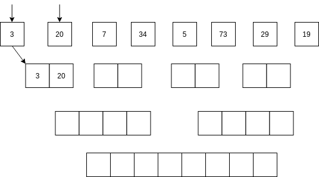

Unidad 1. Trabajo en equipo, estructuras de datos y algoritmos
=================================================================

Introducción
--------------

En esta unidad vamos a introducir algunas herramientas que te permitirán
organizar tu trabajo y trabajar en equipo. Una de las herramientas más
importantes será aquella que permita hacer control de versión.

También vamos a repasar algunos de los conceptos más importantes que has 
estudiado en tus cursos de programación, pero aprovecharemos para estudiar 
algunas estructuras de datos y algoritmos. 

Propósito de aprendizaje
^^^^^^^^^^^^^^^^^^^^^^^^^^

Aplicar herramientas de productividad y control de versión a la hora
de programar.

Aplicar algunas estructuras de datos y algoritmos en la resolución 
de problemas.

Temas
^^^^^^

* Control de versión y flujo de trabajo.

* Conceptos básicos de funcionamiento de un computador.

* Estructuras de datos: listas, stacks, colas, diccionarios, grafos.

* Algoritmos de búsqueda y toma de decisiones.

Lecturas y ejercicios 
------------------------

Ejercicio 1: Git y Github
^^^^^^^^^^^^^^^^^^^^^^^^^^

* Crea una cuenta en GitHub con tu correo institucional de la UPB. Si
  tienes la cuenta, tanto mejor.
* Ingresa a `este <https://www.gitkraken.com/learn/git/tutorials>`__ sitio
  y realiza el curso corto sobre Git.
* Finalmente, observa el siguiente `video <https://www.youtube.com/watch?v=lYAHmthUO1M>`__
  para que analices un posible flujo de trabajo en equipo utilizando herramientas
  de control de versión.
* Para los ejercicios que siguen instala GitKraken. Será la herramienta que usaremos 
  en el curso, además de la línea de comandos.

Lectura 1: trabajo bajo control de versión con forks
^^^^^^^^^^^^^^^^^^^^^^^^^^^^^^^^^^^^^^^^^^^^^^^^^^^^^^

Considera el último video que viste donde te muestran cómo contribuir a un proyecto 
open source. Vamos a suponer que el proyecto lo inició uno de tus compañeros 
del equipo del trabajo. Los pasos que deberías seguir para contribuir al proyecto 
serían:

#. Puedes hacer un fork del repositorio en tu cuenta de GitHub.
#. Clona en tu computador el repositorio.
#. Crea un rama o branch sobre la cual realizarás tu contribución.
#. Realiza únicamente commits sobre los archivos de tu contribución. Observa que el
   video te sugieren no modificar archivos de configuración del proyecto que no tienen
   nada que ver con tus aportes.
#. Envía (push) a GitHub la rama con tus cambios.
#. Cámbiate de nuevo a la rama ``master`` de tu copia local del repositorio.
#. Luego procede a realizar un merge entre la rama que creaste y la master. De esta manera
   tus aportes se añadirán a la rama principal (de tu clone)
#. Luego realiza el commit con tus cambios.
#. Envía (push) de nuevo el repositorio a tu cuenta en GitHub.
#. GitHub detectará las diferencias entre tu rama master y la de tu compañero de equipo.
#. Procede a realizar un pull request.
#. Tu compañero encargado de hacer la integración de tus cambios al proyecto aprobará o no
   tu contribución luego de probar que todo está correcto.

Ejercicio 2: proyecto de Unity bajo control de versión. Primero creando el repo 
^^^^^^^^^^^^^^^^^^^^^^^^^^^^^^^^^^^^^^^^^^^^^^^^^^^^^^^^^^^^^^^^^^^^^^^^^^^^^^^^^^^

Ahora observa `este <https://youtu.be/WH7qDUYHGK8>`__ video. 

Reproduce tu mismo el primer caso: creas un repo en GitHub, lo clonas y luego 
adicionas el proyecto de Unity.

* Cuando creas tu propio repositorio para trabajar con Unity ¿Qué configuración
  debes hacerle al proyecto? 
  (Project Settings: version control (Visible Meta files) y asset serialization (Force text)).
* ¿En dónde debe estar el archivo .gitignore? Abre el archivo y mira las primeras líneas.
  Ahí está la respuesta.

Ejercicio 3: proyecto de Unity bajo control de versión. Primero creando el proyecto de Unity 
^^^^^^^^^^^^^^^^^^^^^^^^^^^^^^^^^^^^^^^^^^^^^^^^^^^^^^^^^^^^^^^^^^^^^^^^^^^^^^^^^^^^^^^^^^^^^^

Ahora reproduce tu mismo el segundo caso (video anterior): creas un proyecto de Unity y luego 
adicionas un repositorio al proyecto. De todas 
maneras no olvides ir a Project Settings (Project Settings: version control 
(Visible Meta files) y asset serialization (Force text)).

Comprueba que el proyecto queda publicado en GitHub.

Ejercicio 4: creación de ramas con features
^^^^^^^^^^^^^^^^^^^^^^^^^^^^^^^^^^^^^^^^^^^^^^

En el minuto 12:10 del video te hablan sobre un flujo de trabajo que involucra la 
creación de ramas.

¿Por qué y para qué se crean las ramas?

En el ejercicio anterior creaste un repo. Ahora adiciona una rama llamada feature1.
Realiza cambios al proyecto en esa rama. Cuando estés satisfecho con los cambios 
realiza un pull request. Como es tu propio proyecto, tu mismo puedes aprobar los cambios
y realizar un merge. Ahora, ten presente que al trabajar en equipo otro de tus compañeros 
puede tener la tarea de aprobar e integrar los cambios.

Ejercicio 5: deshacer errores
^^^^^^^^^^^^^^^^^^^^^^^^^^^^^^^^^^^^^^^^^^^^^^^^^^^^^

Salta al minuto 18:10. Verás cómo deshacer errores. Reproduce los pasos 
en tu proyecto.

Ejercicio 6: consolidación del manejo de git
^^^^^^^^^^^^^^^^^^^^^^^^^^^^^^^^^^^^^^^^^^^^^^^^^

En este ejercicio te voy a pedir que hagas de memoria los siguientes pasos.
Si no recuerdas, vuelve a ver el video. El reto es que puedas hacer todos 
los pasos al menos una vez de memoria.

* Crea un proyecto en Unity
* Colócalo bajo control de versión. No olvides los settings y gitignore.
* Publica el proyecto en GitHub.
* Piensa en un cambio simple a tu proyecto.
* Crea una nueva rama. Realiza el cambio.
* Publica la rama a GitHub.
* Realiza un pull request para hacer un merge a la rama principal.
* Crea otra rama.
* Realiza dos o tres cambios. Realiza commits por cada cambio y no olvides 
  hacer push.
* Ahora deshace todos los cambios, uno por uno, haciendo revert al commit inicial.
  comprueba los cambios en el proyecto cada que los hagas.

Ejercicio 7: control de versión en equipo (ejercicio grupal)
^^^^^^^^^^^^^^^^^^^^^^^^^^^^^^^^^^^^^^^^^^^^^^^^^^^^^^^^^^^^^

Ahora que ya sabes qué es el control de versión, conoces las herramientas
y algunos flujos de trabajo, te voy a proponer un ejercicio en grupo:

* Habla con otro compañero.
* Vas a crear un proyecto en Unity y lo colocarás bajo control de versión.
* Luego vas a escribir 3 features que vas a implementar en ese proyecto. 
  Para cada feature sigue las estrategias del flujo de trabajo que aprendiste. 
  No te compliques, la idea es que practiques control de versión, pero sobre 
  una plataforma real de trabajo.
* Ten presente el flujo de trabajo, por tanto, deberías clonar el repositorio, 
  crear ramas de trabajo, hacer commits, realizar pull request, hacer merge, etc.

¿Para qué te pido que hagas esto? Porque en este curso todo el código que escribas 
debe estar bajo control de versión. Trabajar bajo control de versión es un 
estándar en la industria y es una habilidad que deberás dominar para poder trabajar 
de manera efectiva en equipo. Por tanto, vamos a practicar MUCHO.

¿Por qué Unity? Porque es una herramienta muy versátil con la que puedes hacer
muchos tipos de productos interactivos, no solo videojuegos.

Ejercicio 8: Soporte para grandes archivos LFS
^^^^^^^^^^^^^^^^^^^^^^^^^^^^^^^^^^^^^^^^^^^^^^^^

En el ejercicio 1 te pedí que vieras la serie de videos del tutorial 
de git de Gitkraken. Te voy a pedir que mires de nuevo 
`este <https://youtu.be/S03EEusFxoI>`__ video. ¿Por qué es importante para nosotros?
Porque tu sabes que cuando hacemos aplicaciones interactivas generamos
varios archivos binarios. Por tanto git lfs será necesario en nuestros 
proyectos. 

Lo primero entonces que tendrás que hacer es instalar el soporte para Git LFS. 
Mira `aquí <https://docs.github.com/en/github/managing-large-files/installing-git-large-file-storage>`__ 
cómo lo harías para tu sistema operativo.

Ahora observa `este <https://youtu.be/LS1VI1Y8WTM>`__ video y `este <https://youtu.be/09McJ2NL7YM>`__ 
otro. Te explicarán cómo usar Unity con git lfs.

Ejercicio 9: practicar la creación de un proyecto con soporte para LFS
^^^^^^^^^^^^^^^^^^^^^^^^^^^^^^^^^^^^^^^^^^^^^^^^^^^^^^^^^^^^^^^^^^^^^^^^

Sigue las instrucciones del último video y practica la creación de un proyecto en Unity 
con control de versión y lfs.

Ejercicio 10: información complementaria
^^^^^^^^^^^^^^^^^^^^^^^^^^^^^^^^^^^^^^^^^^^^^^^^^^

¿Hay otra manera más fácil de hacer todo lo anterior? Si. Unity compró en 2020 la herramienta 
PlaticSCM.

Puedes leer al respecto en `este <https://forum.unity.com/threads/announcement-plastic-scm-joins-unity.953252/>`__ 
foro. También encontrarás información reciente en `este <https://youtu.be/PjPK6hxGUFU>`__ video.

.. warning::
    En este curso vamos a utilizar Git y GitHub. Ten en cuenta que todos 
    los repositorios que crees sean públicos para poder hacer seguimiento a tu trabajo.

Ejercicio 11: repaso de conceptos claves antes de comenzar con las estructuras de datos
^^^^^^^^^^^^^^^^^^^^^^^^^^^^^^^^^^^^^^^^^^^^^^^^^^^^^^^^^^^^^^^^^^^^^^^^^^^^^^^^^^^^^^^^^^^

Antes de comenzar a estudiar algunas estructuras de datos y algoritmos, vamos 
repasar algunos conceptos claves.

Asume que dentro de un método tienes lo siguiente:

.. code-block:: csharp
    :linenos:

    classType variable = new classType();

* ¿En qué parte de la memoria queda almacenada variable?
* ¿En qué parte de la memoria queda almacenado el objeto?
* ¿Cuál es la relación entre variable y el objeto que se crea?
* ¿Para qué sirve new?
* ¿Para qué sirve el constructor de una clase?

Ejercicio 12: stack vs heap
^^^^^^^^^^^^^^^^^^^^^^^^^^^^^^^

Considera el siguiente código donde crearemos dos perros Huskies. 
Uno se llamará Pepe y el otro Tom. El color de los ojos de Pepe 
será azul. A Tom lo crearemos copiando a Pepe y luego le cambiaremos el 
color de los ojos a café. Ejecuta el código 
y observa el resultado. Descubre que salió mal. 

.. code-block:: csharp
    :linenos:

      public class Eye
      {
          public string Color;
      }

      public class Husky
      {
          public string Name;
          public Eye RightEye;
          public Eye LeftEye;
          
          public Husky CopyHusky()
          {
              var newDog = new Husky {Name = Name, LeftEye = LeftEye, RightEye = RightEye};
              return newDog;
          }

          public string ToStringDog()
          {
              return String.Format("{0} has a {1} color on his right eye, and a {2} color on his left eye.", Name,RightEye.Color,LeftEye.Color);
          }
      }

      static class MainClass
      {
          public static void Main()
          {
              var pepe = new Husky {Name = "Pepe", LeftEye = new Eye(), RightEye = new Eye()};
              pepe.LeftEye.Color = pepe.RightEye.Color = "blue";
              
              var tom = pepe.CopyHusky();
              tom.Name = "Tom";
              tom.LeftEye.Color = tom.RightEye.Color = "brown";
              
              
              Console.WriteLine(pepe.ToStringDog());
              Console.WriteLine(tom.ToStringDog());
              Console.ReadKey();
      
          }
      }

Ejercicio 13: PROBLEMA
^^^^^^^^^^^^^^^^^^^^^^^

Corrige el problema del código anterior.

Ejercicio 14: tipos valor y tipos referencia
^^^^^^^^^^^^^^^^^^^^^^^^^^^^^^^^^^^^^^^^^^^^^

En C# ¿Cuál es la diferencia entre un tipo valor y un tipo referencia?

Si no lo sabes, dale una mirada a `este <http://www.albahari.com/valuevsreftypes.aspx>`__ 
artículo hasta antes de la sección Memory Disposal.

Ejercicio 15: introducción al concepto de hilo
^^^^^^^^^^^^^^^^^^^^^^^^^^^^^^^^^^^^^^^^^^^^^^^^

Considera el siguiente programa (tomado de `aquí <http://www.albahari.com/threading/>`__):

.. code-block:: csharp
    :linenos:

    internal static class ThreadTest
    {
        internal static void Main()
        {
            var t = new Thread(WriteY); // Kick off a new thread
            t.Start(); // running WriteY()

            // Simultaneously, do something on the main thread.
            for (var i = 0; i < 1000; i++) Console.Write("x");
        }

        private static void WriteY()
        {
            for (var i = 0; i < 1000; i++) Console.Write("y");
        }
    }

Ejecuta varias veces el programa. ¿Qué observas? ¿Notas que se comporta 
diferente cada vez que lo ejecutas?

En este programa tan simple tenemos en un momento dado dos flujos de instrucciones 
independientes que están bajo el control del sistemas operativo. Tu programa 
pierde el control sobre los flujos y el sistema operativo hará lo mejor que pueda 
por darles recursos de procesamiento (CPU/cores). Para ejecutar un flujo de instrucciones el 
sistema operativo de tu computador crea una abstracción denominada Thread. De esta 
manera el sistema operativo puede asignar recursos de cómputo a tu programa, es 
decir, podrías llegar a tener dos cores de tu CPU ejecutando el programa. Cool! No?

Ya te estarás preguntando, bueno, bueno, y ¿En dónde están los tales flujos de 
instrucciones? El primer flujo comenzará ejecutando el método Main hasta terminar 
con el ciclo ``for`` que imprime las ``x``. El segundo flujo ejecutará el método WriteY 
y comenzará cuando el sistema operativo lo decida, luego de que solicites 
iniciar el hilo con ``t.Start();``

Ejercicio 16: diferencia entre objecto, clase, hilo
^^^^^^^^^^^^^^^^^^^^^^^^^^^^^^^^^^^^^^^^^^^^^^^^^^^^

Ahora dale una mirada a este programa (tomado de `aquí <http://www.albahari.com/threading/>`__):

.. code-block:: csharp
    :linenos:
  
    internal static class ThreadTest
    {
        static void Main() 
        {
            new Thread (Go).Start();      
            Go();                         
        }

        private static void Go()
        {
            for (var cycles = 0; cycles < 5; cycles++) Console.Write ('?');
        }
    }

Déjame hacerte unas cuantas preguntas

* ¿Cuál es la diferencia entre una clase y un objeto? 
* ¿Cuál es la diferencia entre un método y un hilo?
* ¿Cuántos flujos de instrucciones puede llegar a tener este programa?
* Parece que en algún momento los hilos están ejecutando el mismo flujo, ¿Qué 
  opinas?
* ¿Los hilos están compartiendo la variable cycles?

Lectura 2: estructuras de datos
^^^^^^^^^^^^^^^^^^^^^^^^^^^^^^^^^^^

Te prometo que vamos a seguir repasando otros conceptos que aprendiste 
en tu curso de programación y diseño orientado a objetos, pero por ahora, 
vamos a trabajar con estructuras de datos y algoritmos. 

¿Qué son las estructuras de datos? son una manera organizada o estructurada de 
almacenar DATOS ( :) ). 

¿Conoces alguna estructura de datos? (Yo creo que varias: arreglos, listas ...)

¿Qué es un algoritmo? No hay una definición formal, pero lo puedes entender
como un plan detallado y paso a paso para resolver un problema.

¿Conoces ejemplos de algunos algoritmos que se usen en la construcción de aplicaciones 
interactivas?

Ejercicio 17: notación BIG-O
^^^^^^^^^^^^^^^^^^^^^^^^^^^^^

¿Cómo analizar la eficiencia de un algoritmo? ¿Cómo comparo entre dos alternativas?

Utilizaremos la notación Big-O.

Observa `este <https://youtu.be/__vX2sjlpXU>`__ video.

Ten como referencia `este <https://www.bigocheatsheet.com/>`__ enlace que muestran en el video.

* Si tengo dos computadores, uno más lento y otro más rápido, ¿Tendría dos medidas 
  Big-O diferentes?

* El análisis Big-O toma en cuenta el mejor caso de ejecución del algoritmo, el peor, 
  el promedio?

* Abre un navegador de Internet. Ingresa a 
  `este <https://www.google.com/search?sxsrf=ALeKk01_tmrFvfdDXWpP_byaAHT8nflMpQ%3A1610980569784&ei=2ZwFYIOxL_bj5NoPjoCq8AY&q=f%28x%29+%3D+x+and+g%28x%29+%3D+log2%28x%29&oq=f%28x%29+%3D+x+and+g%28x%29+%3D+log2%28x%29&gs_lcp=CgZwc3ktYWIQAzoECAAQR1C1LljPc2DSdGgAcAJ4AIABsQGIAa0EkgEDMC40mAEAoAECoAEBqgEHZ3dzLXdpesgBCMABAQ&sclient=psy-ab&ved=0ahUKEwjDgeik2qXuAhX2MVkFHQ6ACm4Q4dUDCA0&uact=5>`__ 
  sitio. Observa la gráfica y la expresión matemática ``f(x) = x and g(x) = log2(x)``. Este 
  recurso puede servirte mucho para visualizar de manera gráfica la notación Big-O entre 
  dos algoritmos.

* ¿Qué algoritmo crees que sea mejor, uno con O(1) o con O(n) ?

Lectura 3: notación BiG-O y documentación oficial 
^^^^^^^^^^^^^^^^^^^^^^^^^^^^^^^^^^^^^^^^^^^^^^^^^^^

En este curso vas a trabajar con C#. Ingresa a 
`este <https://docs.microsoft.com/en-us/dotnet/standard/collections/#algorithmic-complexity-of-collections>`__ 
sitio. Mira por ejemplo la fila ``List<T>.Add``. Observa que tienes dos medidas:
Amortized con ``O(1)``	y Worst Case con	``O(n)``. Amortized es el promedio. 

¿Qué quiere decir lo anterior? Mira, en el caso de una List, la operación Add puede tomar 
solo un paso siempre que tengas memoria disponible en la lista; sin embargo, si recuerdas, 
una List es una estructura de datos dinámica. Por tanto, si no hay espacio para hacer el 
Add toca reservar más memoria, es decir, crecer la List. Tu dirás, eso es una operación. 
¿Entonces de donde salen las N para convertirse en O(n)? Debes copiar TODOS los datos de la 
lista vieja a la nueva (que tiene más memoria). Si tienes N datos, debes hacer N copias.

Dale de nuevo una mirada a `este <https://docs.microsoft.com/en-us/dotnet/standard/collections/>`__ 
sitio y déjalo en tus favoritos para futuras consultas.

Ejercicio 18: arreglos
^^^^^^^^^^^^^^^^^^^^^^^^^^

Comencemos con los arrays. Mira `estos <https://docs.microsoft.com/en-us/dotnet/csharp/programming-guide/arrays/>`__ 
ejemplos.

En notación Big-O ¿Cuál sería el costo de acceder a un elemento del arreglo?

Toma el ejemplo de la página que te compartí. Añade un método y sus 
`sobrecargas <https://docs.microsoft.com/en-us/dotnet/standard/design-guidelines/member-overloading>`__ 
para imprimir todos los items de cada arreglo. ¿Todos te funcionaron? ¿Alguna excepción? ¿Por qué?

Ejercicio 19: listas
^^^^^^^^^^^^^^^^^^^^^^^^^^

Ahora si vamos a practicar un poco más. Ya sabrás que una de las desventajas de los 
arreglos es que son estáticos. Una vez creados, no puedes cambiar su tamaño. Entonces te 
propongo que crees una Lista. Tu me dirás, profe, pero eso ya existe en C#. Tienes toda la razón, 
pero en esta Unidad vamos a aprovechar para calentar motores y repasar tus conceptos de 
programación.

Vamos a tomar el código de `este <https://github.com/PacktPublishing/-C-8-Data-Structures-and-Algorithms/tree/master/Section%202/Arrays>`__ 
repositorio público.

* Crea un proyecto C# en tu editor favorito (yo uso `rider <https://www.jetbrains.com/rider/>`__) 
* Del repositorio público copia el archivo `ArrayList.cs <https://github.com/PacktPublishing/-C-8-Data-Structures-and-Algorithms/blob/master/Section%202/Arrays/ArrayList.cs>`__ 
* Del repositorio público copia el archivo `Program.cs <https://github.com/PacktPublishing/-C-8-Data-Structures-and-Algorithms/blob/master/Section%202/Arrays/Program.cs>`__ 
* Del repositorio público copia el archivo `Extensions.cs <https://raw.githubusercontent.com/PacktPublishing/-C-8-Data-Structures-and-Algorithms/master/Section%202/Arrays/Extensions.cs>`__ 

No olvides ajustar el ``namespace``.

* Lee el código y analiza en detalle. BUSCA todos los elementos sintácticos que no 
  entiendas.
* Ejecuta el programa ¿Cuál de las pruebas aplicaste?
* ¿Ya viste que hay otras dos pruebas para realizar? Realiza las pruebas y compara los resultados.
* Recuerda que estamos repasando, por tanto en la práctica se espera que uses
  la clase `List<T> <https://docs.microsoft.com/en-us/dotnet/api/system.collections.generic.list-1?view=netframework-4.7.2>`__, pero lo importante 
  es que notes que List es un arreglo dinámico, similar, al que está implementado en la clase ArrayList. 

Te haré algunas preguntas relacionadas con el código en ArrayList.cs:

* ¿En ArrayList<T> qué significa <T> ? ¿Qué utilidad le ves a esto?
* ¿Al crear un objeto de tipo ArrayList de qué tamaño es el arreglo inicial?
* En el método ExpandStorage ¿Por qué se hace ``new T[_storage.Length * 2];`` ?

Ahora te pido que abras Program.cs y observes esta línea: ``customArrayList.PrintElements();``. 
En customArrayList estamos almacenando una referencia a un objeto tipo ArrayList<int>. 
Busca en la clase ArrayList el método PrintElements. ¿Lo encontraste?

Tienes razón, no encontraste el método en ArrayList.cs. Resulta que PrintElements es 
lo que se conoce como un `extension-method <https://docs.microsoft.com/en-us/dotnet/csharp/programming-guide/classes-and-structs/extension-methods>`__.

Lee la definición:

Extension methods enable you to "add" methods to existing types without creating a 
new derived type, recompiling, or otherwise modifying the original type. Extension 
methods are static methods, but they're called as if they were instance methods on 
the extended type.

¿Cómo crees que estos métodos funcionen? Te ayudo un poco. Considera este código:

.. code-block::
    :linenos:

    classType varRef = new classType();
    varRef.method();

¿Qué es method? Pues son simplemente unas instrucciones que debe ejecutar 
la CPU del computador. ¿Sobre qué datos se aplicarán esas instrucciones? Sobre 
los datos del objeto cuya dirección está almacenada en varRef. Si lo piensas 
bien, al hacer ``varRef.method();`` es como si le pasaras a method la dirección 
del objeto. Ahora te pregunto. ¿Cómo llamarías a un método estático definido en 
la clase classType?

.. code-block::
    :linenos:

    classType.StaticMethod();

De nuevo ¿Qué es StaticMethod? Son unas instrucciones que debe ejecutar la CPU 
de mi computador. ¿Sobre qué datos actúan esas instrucciones? Creo que ya te diste 
cuenta. Como no estoy pasando la dirección de un objeto al método no queda más de 
otra que el método actúe sobre los datos ESTÁTICOS definidos en la clase classType 
y es por eso que en un método estático solo puedes usar variables estáticas. 
Si usaras variables NO estáticas en el método, estas variables serían 
las de ¿Cuál objeto? COOL!!!

De nuevo: ``customArrayList.PrintElements();``. Vamos a verla en contexto:

.. code-block:: csharp
    :linenos:

    ArrayList<int> customArrayList = new ArrayList<int>();
    customArrayList.Add(4);
    customArrayList.Add(5);
    customArrayList.Add(6);
    customArrayList.PrintElements();

Profe!!!!!!!!!!!!! me estás enredando. Me habías dicho esto: ``customArrayList`` es 
una variable que almacena la dirección de un objeto de tipo ArrayList<int>. Luego,
voy a buscar PrintElements y no lo veo. Pero lo encontré en Extensions.cs:

.. code-block:: csharp
    :linenos:

    public static void PrintElements<T>(this ArrayList<T> arrayList)
        {
            if (null == arrayList || arrayList.Length == 0)
            {
                Console.WriteLine("[]");
                return;
            }
    .
    .
    .

Profe, eso es un método estático. Me acabas de decir que no lo puedo llamar 
sobre la referencia a un objeto: ``customArrayList.PrintElements();`` ¿Y entonces?
(ESPACIO PARA LLANTO!!!)

Mira la declaración del método:

.. code-block:: csharp
    :linenos:

    public static void PrintElements<T>(this ArrayList<T> arrayList)

¿Ves la palabra this? Pues esto es un truco de los creadores del lenguaje para
permitirnos tener Extension methods. La idea es que le pasemos al método 
la dirección del objeto sobre el cuál queremos aplicar las instrucciones 
que estamos definiendo. Mira de nuevo en contexto:

Así llamas al método:

.. code-block:: csharp
    :linenos:

    ArrayList<int> customArrayList = new ArrayList<int>();
    customArrayList.Add(4);
    customArrayList.Add(5);
    customArrayList.Add(6);
    customArrayList.PrintElements();

Así lo declaras:

.. code-block:: csharp
    :linenos:

    public static void PrintElements<T>(this ArrayList<T> arrayList)

¿Ya te diste cuenta? Mira que al llamar ``customArrayList.PrintElements();`` no 
pasas ningún parámetro. Entonces ahí está el truco que están aplicando:
almacenar en la variable ``arrayList`` la dirección en memoria del objeto. 
UFFFFFFF. Interesante. Pero descansemos un rato...

Una última cosa, por ahora. Me cuentas en notación Big-O ¿Cuál es el costo 
de cada método en ArrayList.cs?  (Profe, eso no es descansar...  Perdón).

Ejercicio 20: algoritmos de búsqueda en arreglos
^^^^^^^^^^^^^^^^^^^^^^^^^^^^^^^^^^^^^^^^^^^^^^^^^

Considera que tienes algunos elementos almacenados en un arreglo y quieres buscar 
un elemento en particular. En el peor de los casos tendrías que buscar elemento 
por elemento de manera lineal. ¿Por qué? En notación Big-O cuál sería el costo 
de hacer esta búsqueda?

La búsqueda en un arreglo se puede optimizar si el arreglo está ordenado. 

Ten presente de todas maneras que existen otras estructuras de datos optimizadas para 
los procesos de búsquedas de elementos, como por ejemplo las tablas hash y los árboles.

Analiza el código que esta en `este <https://github.com/PacktPublishing/-C-8-Data-Structures-and-Algorithms/tree/master/Section%202/Searching>`__ repositorio. 
Puedes crear un proyecto y adicionar los cinco archivos .cs que ves allí. NO OLVIDES EJECUTAR el código y observar la salida:

.. code-block:: bash

    Test array: [-34, -21, -18, -12, -3, -1, 0, 3, 8, 12, 23]
    Searching for -12: Linear 3, Binary 3, Binary iterative 3
    Searching for 0: Linear 6, Binary 6, Binary iterative 6
    Searching for 23: Linear 10, Binary 10, Binary iterative 10
    Searching for 2: Linear -1, Binary -1, Binary iterative -1

El método de entrada al programa está en la clase Program.cs. En este ejemplo se realizan 3 tipos de búsquedas: 
lineal, binaria e iterativa. Cada búsqueda está implementada como un Extension Method.

Analiza cada algoritmo de búsqueda:

* ¿Cómo funciona el algoritmo lineal?

* ¿Cómo funciona el algoritmo binario?

  Tips: 
  
  * Nota que algoritmo toma un elemento medio del arreglo y lo compara con el valor a buscar.
    Si es valor es menor que el medio entonces valor estará del lado izquierdo del elemento medio. 
    Si valor es mayor, entonces estará ubica del lado derecho del elemento medio.
  * El algoritmo se repite partiendo siempre la parte del arreglo a buscar a la mitad.
  * Mira por favor esta parte del código:

    .. code-block:: csharp

        private static int BinarySearch(int[] array, int start,int end, int value)
        {
            if (start > end) return -1;

            int middleElement = (end + start) / 2;

            if(value < array[middleElement])
            {
                return BinarySearch(array, start, middleElement - 1, value);
            }
            else if(value > array[middleElement])
            {
                return BinarySearch(array, middleElement + 1, end, value);
            }
            else
            {
                return middleElement;
            }
        }

    Nota que el método BinarySearch se llama así mismo. A esta estrategia la conocemos como ejecución recursiva o algoritmo 
    recursivo. Para implementar este tipo de técnica se utiliza el STACK. Cada que la función se llama, en el stack 
    se crean nuevas variables para los parámetros de la función BinarySearch y sus variables locales. Por tanto, con cada 
    llamado se crea un nuevo juego de variables, unas encima de las anteriores. Adicionalmente se registra como tal 
    el llamado (la dirección de retorno). Si ves con detenimiento el código verás que en algún punto, EN EL TOPE del stack, 
    se llamará una vez más a BinarySearch pero esta vez encontrará el valor y lo retornará. Y como efecto dominó, iran retornando 
    los demás BinarySearch que registramos en el stack hasta retornar el sitio que originalmente llamó a BinarySearch con el resultado 
    encontrado en el TOPE del stack.

    .. image:: ../_static/recursive.png
        :scale: 100%
        :align: center
        :alt: llamado recursivo

|

* ¿Cómo funciona el algoritmo binario iterativo?

* En notación Big-O ¿Cuaĺ es el costo de cada algoritmo de búsqueda?

Ejercicio 21: algoritmos de ordenamiento
^^^^^^^^^^^^^^^^^^^^^^^^^^^^^^^^^^^^^^^^^^^^^^^^^

Para el algoritmo de búsqueda binario del ejercicio anterior es necesario que los elementos estén ordenados.

Analiza el código que está en `este <https://github.com/PacktPublishing/-C-8-Data-Structures-and-Algorithms/tree/c2d3023792751e7cb9dd538b5713198cc1333455/Section%202/Sorting>`__ 
repositorio. De nuevo, crea un proyecto copia las clases y ejecuta el código. El resultado será algo así:

.. code-block:: bash 

    The original array: 
    [84, 47, 85, 60, 70, 52, 21, 46, 37, 17]
    -----------------------
    Selection sort: [17, 21, 37, 46, 47, 52, 60, 70, 84, 85]
    Bubble sort:    [17, 21, 37, 46, 47, 52, 60, 70, 84, 85]
    Merge sort:     [17, 21, 37, 46, 47, 52, 60, 70, 84, 85]
    Quick sort:     [17, 21, 37, 46, 47, 52, 60, 70, 84, 85]

Ten presente que el programa genera un arreglo aleatorio.

* En Big-O ¿Cuál sería la complejidad del algoritmo Selection sort?
* En Big-O ¿Cuál sería la complejidad del algoritmo Bubble sort?

  Para encontrar este costo considera lo siguiente: si tienes un arreglo de tamaño :math:`n` y lo 
  partes a la mitad en la primera iteración, tendrás un arreglo de tamaño :math:`n/2`, en la segunda 
  iteración :math:`n/4`, en la tercera :math:`n/8`, en la k :math:`n/2^k`. Si en la iteración k 
  la longitud del arreglo es 1, entonces cuántas iteraciones necesitas para llegar a un arreglo de tamaño 
  1 partiendo de un arreglo de tamaño n:

.. math::

      n/2^k = 1

      2^k = n
      
      log_2(2^k) = log_2(n) 
      
      k = log_2(n)  

  Entonces, en notación Big-O ¿Cuál sería el costo del algoritmo Bubble sort?

* ¿Cómo funciona el algoritmo merger sort? 
  
  En el algoritmo Merge sort primero se parte en mitades el arreglo hasta obtener cada elemento:

|

|

¿Cuál sería el costo en Big-O de hacer estas particiones?

Luego se comienzan a mezclar así: se toma la parte izquierda y la parte derecha. Se comparan los primeros 
elementos de cada parte. Si el elemento de la parte izquierda es menor que el elemento de la parte derecha ENTONCES 
se selecciona el primer elemento de la parte izquierda y se AVANZA al siguiente item de la parte izquierda.
Sino, se selecciona el elemento de la parte derecha y se avanza al siguiente elemento de la parte derecha.

|

|

|

|

| 

|

|

.. image:: ../_static/merge-7.png
      :scale: 100%
      :align: center
      :alt: merge 7

|

|

|

|

|

|

|

|

|

|

|

* No vamos a analizar el algoritmo Quick sort; sin embargo, la idea del algoritmo es 
  optimizar optimizar el uso de la memoria mientras mantiene una complejidad similar al algoritmo 
  merge sort.

Ejercicio 22: listas enlazadas
^^^^^^^^^^^^^^^^^^^^^^^^^^^^^^^

* ¿Qué es una lista enlazada y para qué sirve?

  Es una colección lineal de elementos que llamamos nodos, solo que cada nodo tiene una referencia 
  al siguiente nodo en la lista o colección. Así por ejemplo, el primer nodo tendrá una referencia 
  al segundo nodo, este al tercero, etc. ¿Y el último nodo? ¡Excelente pregunta! el último nodo 
  tendrá una referencia a NULL. De esta manera podemos identificar el último nodo de la colección.

* ¿Qué pasa si quieres insertar o adicionar un elemento a la lista? Eso sería rápido. Por ejemplo, si vas 
  a insertar, mira la figura:

|

|

* Acceder un elemento de la lista es LEEENNNNTOOOOO ¿Por qué? Porque tienes que recorrer toda la lista 
  en el peor de los casos para encontrar el nodo deseado. Aprovecho y te pregunto, ¿Cómo accedes 
  el tercer elemento de un arreglo? Responde esta pregunta y luego que analices el costo de acceder 
  un nodo de la lista enlazada compara. 

* Entonces, ya puedes ver en este punto por lo que te digo que una lista enlazada es mejor que un 
  arreglo para insertar o borrar elementos, pero peor si necesitas acceder el elemento.

* ¿Cuándo puedes usar una lista enlazada? Por ejemplo, para manejar la lista de suscriptores a un evento y 
  para implementar otras estructuras de datos como los stacks y las colas.

* En el siguiente `enlace <https://github.com/PacktPublishing/-C-8-Data-Structures-and-Algorithms/tree/master/Section%203/LinkedList>`__ 
  encontrarás una implementación de una lista enlazada. Estudia detalladamente su implementación.

  Te dejo algunas preguntas:

  * En término de sintaxis de C# ¿Qué es esto?

    .. code-block:: csharp

        public Node<T> Next {get;set;}

  * En términos de sintaxis de C# ¿Qué es esto?

    .. code-block:: csharp

        public (Node<T> previous, Node<T> found) FindFirst(T value)
  
  * En notación Big-O ¿Cuál sería el costo de acceder un elemento en la lista enlazada. Y otra vez  
    ¿Cuál sería el costo de acceder un elemento en un arreglo? ¿Qué estructura de datos sería mejor 
    para acceder rápidamente elementos?

  * Al buscar un nodo ¿Por qué necesitas retornar el nodo que buscas y el anterior?

    .. code-block:: csharp

        public (Node<T> previous, Node<T> found) FindFirst(T value)

Ejercicio 23: reto listas enlazadas
^^^^^^^^^^^^^^^^^^^^^^^^^^^^^^^^^^^^^

Implementa un programa que te permita contar la cantidad de nodos de una lista enlazada.

Ejercicio 24: stacks y queues
^^^^^^^^^^^^^^^^^^^^^^^^^^^^^^^^^^^^^

Los stacks sirven para apilar información usando la estrategia last input - first output (LIFO). Te puedes 
imaginar los stacks como pilas de platos. Tu vas armando la pila de platos y cuando necesitas un 
plato tomas el último que colocaste en la pila.

Las colas funcionan con la lógica first input - first output (FIFO). Son muy útiles para comunicar dos hilos 
en un proceso. El hilo 1 envía mensajes a la cola, uno tras otro. El hilos 2 los va consumiendo en 
orden FIFO, es decir, el primer mensaje enviado por el hilo 1 será el primero en ser retirado por el hilo 2 y así 
con los demás mensajes.

En este `enlace <https://github.com/PacktPublishing/-C-8-Data-Structures-and-Algorithms/tree/master/Section%203/Stack>`__ 
puedes ver cómo está implementado un stack. Toma solo los archivos .cs y creo tu propio proyecto.

* Realiza una gráficas que ilustren el funcionamiento del stack al adicionar y al sacar datos.
  
En este `enlace <https://github.com/PacktPublishing/-C-8-Data-Structures-and-Algorithms/tree/master/Section%203/Queue>`__ 
puedes ver cómo está implementado una queue. Toma solo los archivos .cs y creo tu propio proyecto.

* Realiza una gráficas que ilustren el funcionamiento de la queue al ingresar y sacar nodos de ella.

Ejercicio 25: hash tables y diccionarios
^^^^^^^^^^^^^^^^^^^^^^^^^^^^^^^^^^^^^^^^^

Las hash tables, al igual que los diccionarios se utilizan para resolver un problema concreto: ACELERAR la búsqueda de 
elementos. ¿Cómo? Las hash tables usan funciones hash. Una función hash calcula un número único
y con ese número único se puede ubicar rápidamente el elemento en una tabla (hash table).

Los diccionarios en C# son una implementación de las hash table; sin embargo son diferentes.

Los códigos de producción que implementan las características internas de una hash table y un diccionario 
son complejos; sin embargo, vamos a analizar una implementación SIMPLE, no optimizada, no de producción de una hash table,
SOLO para que veas conceptualmente cómo funciona:

* Copia los archivos .cs de `este <https://github.com/PacktPublishing/-C-8-Data-Structures-and-Algorithms/tree/master/Section%204/Hashtable>`__ 
  enlace y crea un proyecto. Ejecuta el código.
* Realiza dibujos que ilustren cómo es el funcionamiento interno de esta implementación 
  de una hash table para las operaciones Add, Get y remove.
* ¿Cómo se calcula el hash de cada una clave?
* ¿Puedo tener varias claves con el mismo hash?
* ¿Cómo se resuelven las colisiones de claves con el mismo hash?
* Para qué se utilizan las listas enlazadas en esta implementación?

Ejercicio 26: ejemplo de diccionarios
^^^^^^^^^^^^^^^^^^^^^^^^^^^^^^^^^^^^^^^^^

En `este <https://github.com/PacktPublishing/-C-8-Data-Structures-and-Algorithms/tree/master/Section%204/HashCollections>`__ 
enlace vas a encontrar algunos ejemplos de cómo usar diccionarios y hash tables:

* De nuevo, crear un proyecto y copia los archivos .cs necesarios para correr el ``HashingTricks.Demo();``
* Nota en la clase Program.cs

  .. code-block:: csharp

      using System;
      using System.Collections.Generic;

      namespace HashCollections
      {
          class Program
          {
              static void Main(string[] args)
              {
                  //HashCollections.DictionaryDemo();
                  //HashCollections.HashsetDemo();
                  HashingTricks.Demo();
              }
          }
      }

  Ves que hay tres demos? vamos a probar solo el primero. Por tanto: 
  
  * borra la línea ``HashingTricks.Demo();`` y ``HashCollections.HashsetDemo();``
  * Ejecuta el demo.

* Para terminar con este ejercicio, realiza un resumen así:
  
  * ¿Cómo adiciono un item a un diccionario? Ilustra esto de dos maneras.
  * ¿Cómo recupero un item de un diccionario?
  * Describe cómo se usa el método TryGetValue.
  
Ejercicio 27: evaluación formativa
^^^^^^^^^^^^^^^^^^^^^^^^^^^^^^^^^^^^^^^

Este ejercicio es simple: ¿Cuál es la gracia de usar una ESTRUCTURA DE DATOS DICCIONARY? 
¿Qué buscamos optimizar?

CASO DE ESTUDIO
^^^^^^^^^^^^^^^^^^^

Este caso de estudio es sobre un videojuego sencillo basado en el uso 
de estructuras de datos y algoritmos de búsqueda.

Vamos a utilizar `este <https://github.com/lordjesus/Packt-Introduction-to-graph-algorithms-for-game-developers>`__ 
código en GitHub de `Daniel Jallov <http://www.jallov.com/>`__

* `Descarga <https://github.com/lordjesus/Packt-Introduction-to-graph-algorithms-for-game-developers/archive/master.zip>`__ 
  el repositorio.
* Abre en Unity el juego 8 puzzle game. Puedes usar la versión 2019.4.
* Carga la escena 8puzzle.
* Ejecuta el juego:

  .. image:: ../_static/8puzzle.gif
      :scale: 100%
      :align: center
      :alt: juego

Antes de analizar el proyecto, vas revisar, de manera aislada solo el algoritmo para resolver 
el problema.

* En `este <https://github.com/lordjesus/Packt-Introduction-to-graph-algorithms-for-game-developers/tree/master/Code%20for%20videos/Video%202.6%20-%208%20puzzle>`__ 
  sitio puedes encontrar dos clases: Program.cs y PuzzleSolver.cs.
* Crea en un proyecto en Visual Studio o en Rider que incluya el contenido de los archivos 
  anteriores.
* Ejecuta el programa. Verás algo similar a esto:

  .. code:: bash
  
      Solving 
      1 6 4 
      5 8 2 
      * 7 3 

      Depth-first search took 227 ms
      Depth-first search path contains 42181 states

      Breadth-first search took 34 ms
      Breadth-first search path contains 21 states

      Printing solution

      1 2 3 
      4 5 6 
      7 8 * 

      1 2 3 
      4 5 6 
      7 * 8 

      1 2 3 
      4 * 6 
      7 5 8 

      1 2 3 
      4 6 * 
      7 5 8 

      1 2 * 
      4 6 3 
      7 5 8 

      1 * 2 
      4 6 3 
      7 5 8 

      1 6 2 
      4 * 3 
      7 5 8 

      1 6 2 
      * 4 3 
      7 5 8 

      * 6 2 
      1 4 3 
      7 5 8 

      6 * 2 
      1 4 3 
      7 5 8 

      6 4 2 
      1 * 3 
      7 5 8 

      6 4 2 
      1 5 3 
      7 * 8 

      6 4 2 
      1 5 3 
      7 8 * 

      6 4 2 
      1 5 * 
      7 8 3 

      6 4 * 
      1 5 2 
      7 8 3 

      6 * 4 
      1 5 2 
      7 8 3 

      * 6 4 
      1 5 2 
      7 8 3 

      1 6 4 
      * 5 2 
      7 8 3 

      1 6 4 
      5 * 2 
      7 8 3 

      1 6 4 
      5 8 2 
      7 * 3 

      1 6 4 
      5 8 2 
      * 7 3 

* El programa ejecuta dos algoritmos de búsqueda: `Depth First Search` y 
  `Breadth First Search`, pero solo se imprime el resultado de `Breadth First Search`.
* Observa detenidamente el resultado, lo que estás viendo son los pasos para 
  llegar de aquí:

  .. code:: bash

      1 6 4
      5 8 2
      * 7 3

  Hasta aquí:

  .. code:: bash

      1 2 3
      4 5 6
      7 8 *

Pregunta 1
#############

Para responder esta pregunta vas a necesitar analizar cómo funciona el 
algoritmo ``Breadth First Search`` (BFS). El algoritmo te permitirá recorrer 
los nodos o vértices de un GRAFO. ¿Qué es un grafo? es una estructura de 
datos compuesta por VÉRTICES y por ARCOS. Los arcos son las líneas 
que conectan los vértices. En la siguiente gráfica te voy a mostrar 
un grafo compuesto por 7 vértices y 9 arcos. Vamos a recorrer o visitar 
cada vértice del grafo utilizando el algoritmo BFS. Nota que 
usaremos además dos estructuras de datos: una cola (queue) y una 
lista (nodos visitados). 

Primero colocamos en la cola el nodo inicial, es decir, el nodo por donde 
comenzaremos la búsqueda: V6. 

Ahora lo sacamos de la cola, lo registramos como un nodo visitado y marcamos los 
nodos con los cuales está conectado:

Recuerda que la cola funciona con la lógica FIFO: first in, first out. Entonces 
repetimos el mismo proceso anterior con los demás nodos de la cola hasta 
que terminemos de recorrer todo el grafo o hasta que lleguemos al nodo deseado.

|

|

|

|

|

Vamos a utilizar este algoritmo para solucionar el puzzle. En este 
caso, partimos de este nodo:

.. code:: bash

      1 6 4
      5 8 2
      * 7 3

Y queremos llegar a este otro:

.. code:: bash

      1 2 3
      4 5 6
      7 8 *

La solución al problema será EL CAMINO que conecta a estos dos ESTADOS 
del puzzle.

Ahora si, la pregunta 1. Explica ¿Cómo funciona la implementación 
del algoritmo BFS que está `aquí <https://github.com/lordjesus/Packt-Introduction-to-graph-algorithms-for-game-developers/tree/master/Code%20for%20videos/Video%202.6%20-%208%20puzzle>`__.

Ilustra su funcionamiento utilizando un puzzle más simple. Parte de este punto:

Para llegar aquí

Pregunta 2
############

Explica cuáles son los pasos que sigue el programa para resolver el problema. Por ejemplo, 
Observa el archivo Program.cs:

.. code:: csharp

    static void Main(string[] args)
    {
      ...

      string state = PuzzleSolver.GenerateRandomSolvableState();

        ...

      path = PuzzleSolver.BreadthFirstSearch(state);

        ...
    }

Aquí los pasos son: 

#. Generar un problema inicial: `string state = PuzzleSolver.GenerateRandomSolvableState();`
#. Encontrar el camino de nodos o el recorrido desde el problema inicial 
   hasta la solución: `path = PuzzleSolver.BreadthFirstSearch(state);`

¿Qué pasos se hacen en `BreadthFirstSearch`?

Pregunta 3
##############

En el algoritmo BFS ¿Para qué y cómo se están usando una lista, una cola y un diccionario?

Pregunta 4
##############

Ilustra de manera similar a la pregunta 1 ¿Cómo funciona el algoritmo 
Depth-First Search?

Pregunta 5
##############

En la implementación del algoritmo Depth-First Search ¿Para qué y cómo se 
está utilizando un stack?

Pregunta 6
##############

En el proyecto de Unity. Observa el código Block.cs.

¿Qué es esto y para qué sirve?

.. code:: csharp

    public delegate void ClickedEventHandler(object sender, EventArgs e);
    public event ClickedEventHandler Clicked;

Pregunta 7
##############

Explica ¿Qué está pasando aquí?

.. code:: csharp

    protected virtual void OnClicked(EventArgs e)
    {
        if (Clicked != null)
        {
            Clicked(this, e);
        }
    }

Pregunta 8
##############

Sin buscar la implementación de los eventos en C# ¿Qué estructura 
de datos crees que se podría utilizar para implementar 
un evento? Explica tu respuesta.

Pregunta 9
##############

¿Qué pasa en el programa cuando se da click en uno de los números?

Pregunta 10
##############

¿Qué parte del código gestiona los click de los números?

Pregunta 11
##############

¿Cómo se conecta el PuzzleManager con cada número del puzzle?

Pregunta 12
##############

¿Qué pasos ejecuta la aplicación cuando das click en solve?

Pregunta 13
##############

¿Qué es una corrutina y cómo está funcionando en este caso 
para animar el movimiento de los números en cada uno de los estados 
almacenados en el path con la solución?

EVALUACIÓN DE LA UNIDAD
^^^^^^^^^^^^^^^^^^^^^^^^^

La evaluación se publicará en la semana de evaluación. Por tanto, te recomiendo que termines la mayor 
cantidad de ejercicios que puedas, ojalá todos, antes de la semana de evaluación. Recuerda que 
el trayecto de actividades que vamos a realizar tiene como objetivo prepararte para esta evaluación. 