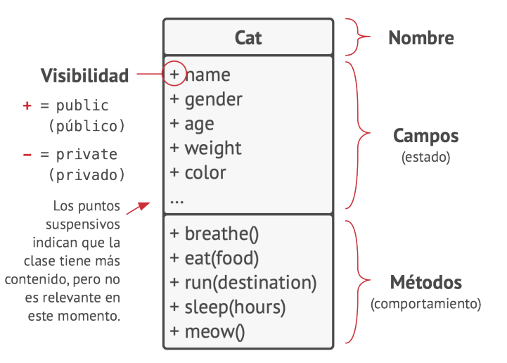
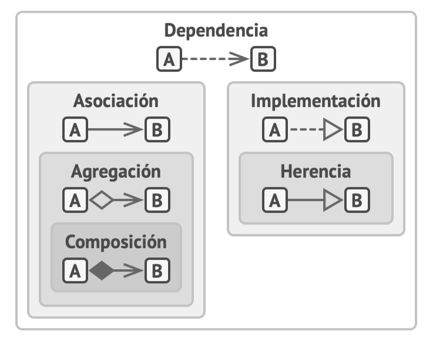
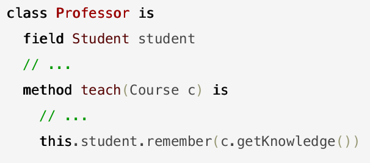
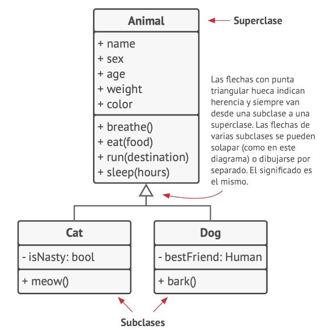
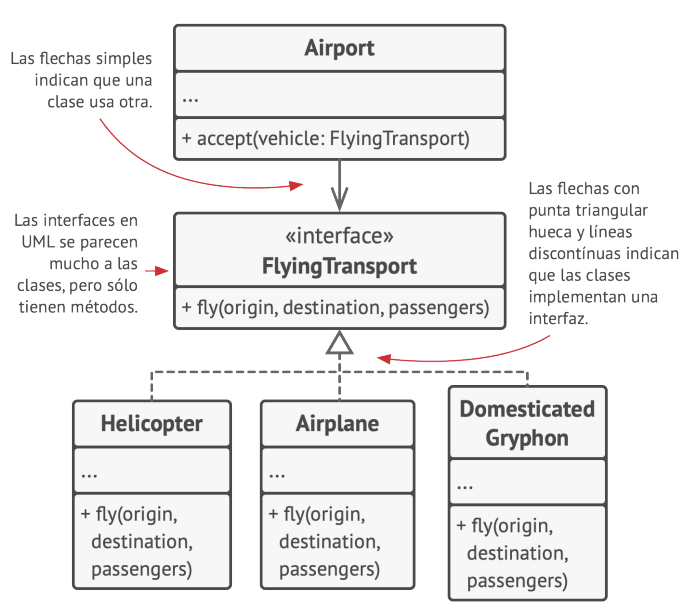
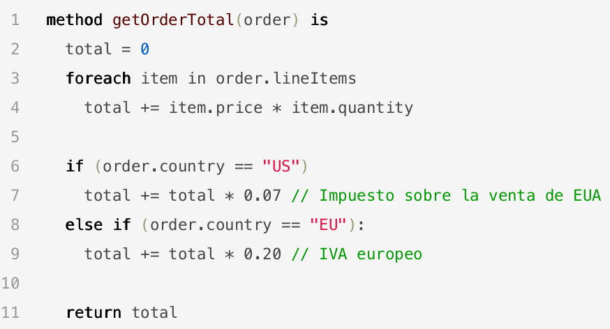
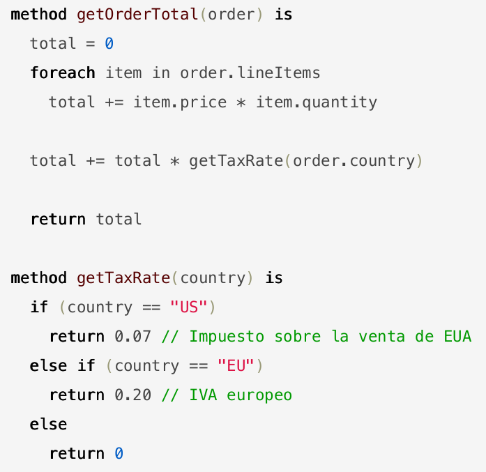

Unidad 2. Patrones de diseño
==========================================

Introducción
--------------

En esta unidad vamos a estudiar y aplicar algunos principios de desarrollo 
de software que te ayudarán a estructurar tus aplicaciones interactivas para 
que sean más fáciles de modificar y extender facilitando el trabajo en equipo.

Propósito de aprendizaje
***************************

Analizar algunos principios de diseño y patrones para la estructuración 
de aplicaciones interactivas utilizando plataformas de software interactivas.

Temas
************

* Repaso de algunos conceptos básicos de programación orientada a objetos.

* Principios de diseño de software.

* Análisis e implementación de algunos patrones de diseño.

* El análisis de arquitecturas guiadas por eventos y por datos.        

Lecturas y ejercicios
------------------------

Sesión 1: repaso POO
**********************

Ejercicio 1: repaso sobre el concepto de tipo valor y tipo referencia en C#
^^^^^^^^^^^^^^^^^^^^^^^^^^^^^^^^^^^^^^^^^^^^^^^^^^^^^^^^^^^^^^^^^^^^^^^^^^^^^^

Vamos al tablero a repasar de nuevo este concepto tan importante en C#.

.. note:: Conclusión de la discusión en el tablero.

  Con un tipo valor, el contenido actual de la variable vive donde la variable viva. Con un 
  tipo referencia, el contenido de la variable vive en el HEAP y la variable en si contiene 
  únicamente una referencia al contenido actual.

¿Puedes hacerte una imagen mental de la frase anterior? Si no lo logras por favor pregunta.

Ejercicio 2: reflexiona sobre los tipo valor y los tipo referencia
^^^^^^^^^^^^^^^^^^^^^^^^^^^^^^^^^^^^^^^^^^^^^^^^^^^^^^^^^^^^^^^^^^^

¿Recuerdas el ejercicio de los Huskies de la Unidad 1? 

Crea un proyecto tipo consola y ejecuta el siguiente código:

.. code-block:: csharp

      public class Eye
      {
          public string Color;
      }

      public class Husky
      {
          public string Name;
          public Eye RightEye;
          public Eye LeftEye;
          
          public Husky CopyHusky()
          {
              var newDog = new Husky {Name = Name, LeftEye = LeftEye, RightEye = RightEye};
              return newDog;
          }

          public string ToStringDog()
          {
              return String.Format("{0} has a {1} color on his right eye, and a {2} color on his left eye.", Name,RightEye.Color,LeftEye.Color);
          }
      }

      static class MainClass
      {
          public static void Main()
          {
              var pepe = new Husky {Name = "Pepe", LeftEye = new Eye(), RightEye = new Eye()};
              pepe.LeftEye.Color = pepe.RightEye.Color = "blue";
              
              var tom = pepe.CopyHusky();
              tom.Name = "Tom";
              tom.LeftEye.Color = tom.RightEye.Color = "brown";
              
              
              Console.WriteLine(pepe.ToStringDog());
              Console.WriteLine(tom.ToStringDog());
              Console.ReadKey();
      
          }
      }

Trata de recordar cuál era el problema, pero aún no lo corrijas.

Ahora considera el siguiente código:

.. code-block:: csharp

    using System;

    namespace valRefTest
    {
        public struct Eye
        {
            public string Color;
        }

        public class Husky
        {

            public string Name;
            public Eye RightEye;
            public Eye LeftEye;

            public Husky CopyHusky()
            {
                Husky newDog = new Husky();
                newDog.Name = Name;
                newDog.LeftEye = LeftEye;
                newDog.RightEye = RightEye;
                return newDog;
            }

            public string ToStringDog()
            {
                return (Name + " has a " + RightEye.Color +
                        " color on his right eye, and a " +
                        LeftEye.Color + " color on his left eye.");
            }
        }

        class MainClass
        {
            public static void Main()
            {

                Husky pepe = new Husky();
                pepe.Name = "pepe";
                pepe.LeftEye = new Eye();
                pepe.RightEye = new Eye();
                pepe.LeftEye.Color = pepe.RightEye.Color = "blue";

                Husky tom = pepe.CopyHusky();
                tom.Name = "tom";
                tom.LeftEye.Color = tom.RightEye.Color = "brown";

                Console.WriteLine(pepe.ToStringDog());
                Console.WriteLine(tom.ToStringDog());

                Console.ReadKey();

            }
        }
    }

Ahora prueba de nuevo con este código.

¿Qué observas al ejecutarlo?

.. note:: Ejercicio

    Realiza un diagrama que tenga el HEAP y el STACK para cada uno de los códigos anteriores.

Ejercicio 3: tipo valor vs tipo referencia (discusión grupal)
^^^^^^^^^^^^^^^^^^^^^^^^^^^^^^^^^^^^^^^^^^^^^^^^^^^^^^^^^^^^^

Ahora vamos a compartir los resultados del ejercicio anterior entre todos.

Ejercicio 4: reto tipo valor vs tipo referencia
^^^^^^^^^^^^^^^^^^^^^^^^^^^^^^^^^^^^^^^^^^^^^^^^^

Considera el siguiente código en el cual se está representando 
un laberinto de 5x5 baldosas con un diccionario.

Crea un proyecto y ejecuta el siguiente código:

.. code-block:: csharp

    using System;
    using System.Collections.Generic;

    namespace retoValRef
    {
        class Node
        {
            public bool isExplored = false;
            public Node isExploredFrom = null;
            public int X { get; set; }
            public int Y { get; set; }

            public Node(int _x, int _y)
            {
                X = _x;
                Y = _y;
            }
            
            public string NodeString()
            {
                return string.Format("{0},{1}",X,Y);
            }
            
        }
        class Vector2Int
        {
            public int X{ get; set; }
            public int Y{ get; set; }

            public Vector2Int(int _x, int _y)
            {
                X = _x;
                Y = _y;
            }
        }
        
        class Program
        {
            static void Main(string[] args)
            {
                Dictionary<Vector2Int, Node> _block = new Dictionary<Vector2Int, Node>();
              
                for (int j = 0; j > -5; j--)
                {
                    for (int i = 0; i < 5; i++)
                    {
                            _block.Add(new Vector2Int(i,j), new Node(i,j));
                            Console.Write('O');
                    }
                    Console.WriteLine();
                }

                try
                { 
                    Console.WriteLine("Try to get a Node from new Vector2Int");
                    Console.WriteLine(_block[ new Vector2Int(0, 0)].NodeString());
                }
                catch (Exception e)
                {
                    Console.WriteLine(e);
                }
                
                List<Vector2Int> keys = new List<Vector2Int>();
                foreach( KeyValuePair<Vector2Int, Node> kvp in _block )
                {
                    keys.Add(kvp.Key);
                }

                try
                { 
                    Console.WriteLine("Try to get a Node from a Vector2Int in KeyValuePair");
                    Console.WriteLine(_block[keys[0]].NodeString());
                }
                catch (Exception e)
                {
                    Console.WriteLine(e);
                }
            }
        }
    }

Realiza diagramas del HEAP y el STACK donde muestres la relación entre las 
variables y los objetos del programa anterior. ¿Por qué el primer try genera un excepción 
y el segundo no?

Ejercicio 5: repaso sobre el concepto de miembro static
^^^^^^^^^^^^^^^^^^^^^^^^^^^^^^^^^^^^^^^^^^^^^^^^^^^^^^^^^^^^

Analicemos juntos en el tablero el siguiente programa:

.. code-block:: csharp

  using System;

  namespace staticTest
  {
      class Test
      {
          public int a;
          public int b;
          public static int c;
          public int getStaticVar()
          {
              return c;
          }
      }

      class Program
      {
          static void Main(string[] args)
          {
              Test testObj = new Test();
              testObj.a = 1;
              testObj.b = 2;
              testObj.c = 3;
              Test.c = 20;
              int c = testObj.getStaticVar();
              Console.WriteLine(c);
          }
      }
  }

Trabajo autónomo 1: repaso POO
*******************************

Esta sesión de trabajo autónomo tiene una duración estimada de 1 hora 20 minutos 
aproximadamente.

Ejercicio 6: repaso sobre el concepto de interface
^^^^^^^^^^^^^^^^^^^^^^^^^^^^^^^^^^^^^^^^^^^^^^^^^^^^

Vas a repasar el concepto de ``interface`` analizando detenidamente `este <https://youtu.be/MZOrGXk4XFI>`__ 
video. El video dura 14 minutos. Los puedes ver un par de veces o detenerte para analizar con calma 
en una hoja de papel ciertas partes.

Escribe en un bitácora de trabajo las respuestas a estas preguntas cuyas respuestas encontrarás en el video.

#. ¿Por qué las interfaces permiten escribir código más limpio y reusable?
#. ¿Por qué las interfaces permiten usar varias clases de la misma manera?
#. ¿Qué debes hacer para implementar una interface en una clase?
#. ¿Qué debes hacer en una clase cuando esta implementa una interface que implementa otra interface? 

(Tiempo estimado: 30 minutos)

Ejercicio 7: repaso sobre el concepto de interface: código en Unity
^^^^^^^^^^^^^^^^^^^^^^^^^^^^^^^^^^^^^^^^^^^^^^^^^^^^^^^^^^^^^^^^^^^^

En el minuto 1:48 al minuto 6:33 del video te muestran un ejemplo:

* Abre Unity y reproduce el ejemplo.
* Busca en la documentación todas aquellas partes del código que no recuerdes.
* Anota las partes que no comprendes para discutirlas con tus compañeros o en preguntar 
  en las sesiones de clase.

(Tiempo estimado: 20 minutos)

Ejercicio 8: repaso sobre el concepto de interface: ejemplo en una aplicación interactiva
^^^^^^^^^^^^^^^^^^^^^^^^^^^^^^^^^^^^^^^^^^^^^^^^^^^^^^^^^^^^^^^^^^^^^^^^^^^^^^^^^^^^^^^^^^

En el minuto 8:34 te muestran un ejemplo de aplicación de las interfaces en una aplicación 
interactiva.

En el minuto 9:43 te muestran la que la clase Bullet necesita identificar el enemigo con 
el cual colisiona. PIENSA en el siguiente escenario. Ya terminaste tu aplicación interactiva 
y todo está probado. Unos meses más tarde, tu jefe te pide implementar una nueva funcionalidad 
en la cual necesitas adicionar un nuevo enemigo u objeto con el cual la Bullet puede colisionar.
En este caso tendrías que modificar el script Bullet que ya habías hecho y probado.

¿Cómo puedes usar las interfaces para poder adicionar más enemigos u objetos que interactúen con 
una Bullet sin necesidad de cambiar el script de Bullet?

Escribe los pasos necesarios. Captura en el video las pantallas donde está la implementación 
a la pregunta anterior y pega estas imágenes en un tu bitácora de trabajo para futuras 
referencias.

(Tiempo estimado: 20 minutos)

Ejercicio 9: repaso sobre el concepto de interface: repite de memoria
^^^^^^^^^^^^^^^^^^^^^^^^^^^^^^^^^^^^^^^^^^^^^^^^^^^^^^^^^^^^^^^^^^^^^^^

* Crea una aplicación de consola.
* Define tres clases y una interfaz.
* Implementa la interfaz en dos de las clases, la otra clase será la que contiene el método Main.
* En la función Main crea instancias de las clases que implementan la interfaz.
* Crea una función a la cual le pasarás una referencia a la interfaz.
* Llama la función anterior pasando referencias a las dos instancias creadas.

(Tiempo estimado: 10 minutos)

Sesión 2: principios de diseño de software
********************************************

Ejercicio 10: repaso de algunos diagramas UML 
^^^^^^^^^^^^^^^^^^^^^^^^^^^^^^^^^^^^^^^^^^^^^^^^^^^
(Imágenes tomadas de `este <https://refactoring.guru/design-patterns>`__ sitio).

Vamos al tablero y hablemos de estos diagramas:

* Dependencia: cuando ciertos cambios en una clase puede provocar modificaciones en otra.
  Ocurre cuando se usan nombre concretos de clases en otras. ¿Qué puedo hacer para que 
  la dependencia sea más débil? Hacer que el código dependa de interfaces o clases abstractas
  en lugar de clases concretas. Por ejemplo, tipos en la firma de un método, constructores al 
  instanciar una clase.
* Asociación: cuando un objeto interactúa o utiliza otra. Es un tipo de dependencia, pero en este 
  caso un objeto siempre tendrá acceso a los objetos con los que interactúa. Por ejemplo, un campo
  en una clase.

Si alguien cambia el nombre o un parámetro de ``getKnowledge`` el código se rompe, hay una dependencia. 
Con ``student`` también hay una dependencia si alguien el método ``remember``; sin embargo, student es 
un campo de la clase Professor que siempre está disponible y por tanto será una asociación igualmente.

* Agregación: tipo de asociación que representa una relación uno a muchos. El componente puede 
  existir sin el contenedor. La punta de diamante vacío en el diagrama es el contenedor y la flecha apunta 
  al componente.
* Composición: es una asociación en la que un objeto está compuesto por otros. Las partes no pueden 
  vivir sin el contenedor. El contenedor gestiona el ciclo de vida de las partes.

Ejercicio 11: inventa ejemplos de la explicación anterior  
^^^^^^^^^^^^^^^^^^^^^^^^^^^^^^^^^^^^^^^^^^^^^^^^^^^^^^^^^^^^^

Vuelve a leer las explicaciones anteriores. Inventa ejemplos en UML para las relaciones de 
dependencia, asociación, agregación, composición, herencia e implementación. Implementa 
los diagramas.

Por ejemplo mira estos diagramas para la relación de herencia y la relación de implementación.

Relación de herencia:

Relación de implementación:

Ejercicio 12: concepto de los principios de diseño de software
^^^^^^^^^^^^^^^^^^^^^^^^^^^^^^^^^^^^^^^^^^^^^^^^^^^^^^^^^^^^^^^

En este ejercicio vamos a abordar algunos conceptos relacionados con los 
principios de DISEÑO DE SOFTWARE.

Vamos a utilizar `esta <https://docs.google.com/presentation/d/1ko3k9wePbRp2GVdPJTSmhqRJNh7UUBZ6DnPWs4FFB18/edit?usp=sharing>`__ presentación.

Con los siguientes ejercicios vas a practicar algunos de los principios. Los ejemplos son tomados 
de `este <https://refactoring.guru/design-patterns>`__  sitio.

Ejercicio 13: principio encapsula lo que varía
^^^^^^^^^^^^^^^^^^^^^^^^^^^^^^^^^^^^^^^^^^^^^^^^

Considera el siguiente seudocódigo:
  

* ¿Qué es lo que varía?

* ¿Cómo lo encapsulas?

.. warning:: ALERTA DE SPOILER

Ejercicio 14: programa a una interfaz, no a una implementación
^^^^^^^^^^^^^^^^^^^^^^^^^^^^^^^^^^^^^^^^^^^^^^^^^^^^^^^^^^^^^^^

DEPENDE de abstracciones, no de clases concretas. ¿Por qué? 
Piensa en lo anterior y participa en clase con tu opinión. Piensa 
en el trabajo autónomo bloque 1. ¿Te recuerda algo?

Iniciemos con este código:

.. code-block:: csharp

    using System;

    namespace companyIdeaInicial
    {

        class Designer
        {
            public void designArchitecture()
            {
                Console.WriteLine("Design");
            }
        }

        class Programmer
        {
            public void writeCode()
            {
                Console.WriteLine("Coding");
            }
        }
        
        class Tester
        {
            public  void testSoftware()
            {
                Console.WriteLine("Testing");
            }
        }

        class Company
        {
            public void createSoftware()
            {
                Designer d = new Designer();
                d.designArchitecture();
                Programmer p = new Programmer();
                p.writeCode();
                Tester t = new Tester();
                t.testSoftware();
            }
        }
        
        class Program
        {
            static void Main(string[] args)
            {
                Company c = new Company();
                c.createSoftware();
            }
        }
    }

Problema: la clase Company está FUERTEMENTE ACOPLADA con las clases de empleados 
concretos. Entonces hagamos que company dependa de una interfaz.

.. code-block:: csharp

    using System;

    namespace companyIdeaInicial
    {
        interface IEmployee
        {
            public void doWork();
        }
        class Designer:IEmployee
        {
            private void designArchitecture()
            {
                Console.WriteLine("Design");
            }

            public void doWork()
            {
                designArchitecture();
            }
        }

        class Programmer:IEmployee
        {
            private void writeCode()
            {
                Console.WriteLine("Coding");
            }

            public void doWork()
            {
                writeCode();
            }
        }
        
        class Tester:IEmployee
        {
            private  void testSoftware()
            {
                Console.WriteLine("Testing");
            }

            public void doWork()
            {
                testSoftware();
            }
        }

        class Company
        {
            public void createSoftware()
            {
                IEmployee[] employees = new IEmployee[] { new Designer(),new Programmer(),new Tester()};
                foreach (var employee in employees)
                {
                    employee.doWork();
                }
            }
        }
        
        class Program
        {
            static void Main(string[] args)
            {
                Company c = new Company();
                c.createSoftware();
            }
        }
    }

Problema: la clase Company sigue acoplada a las clases de los empleados porque sigue siendo 
necesario crear el arreglo de empleados para una empresa específica. Si tuviéramos que crear 
una nueva empresa con otros empleados, toca MODIFICAR la clase Company.

Lo que puedes hacer es crear un nuevo método ABSTRACTO que te de los empleados específicos 
que tendrá que definir una empresa concreta:

.. code-block:: csharp

    using System;

    namespace companyIdeaInicial
    {
        interface IEmployee
        {
            public void doWork();
        }
        class Designer:IEmployee
        {
            private void designArchitecture()
            {
                Console.WriteLine("Design");
            }

            public void doWork()
            {
                designArchitecture();
            }
        }

        class Programmer:IEmployee
        {
            private void writeCode()
            {
                Console.WriteLine("Coding");
            }

            public void doWork()
            {
                writeCode();
            }
        }
        
        class Tester:IEmployee
        {
            private  void testSoftware()
            {
                Console.WriteLine("Testing");
            }

            public void doWork()
            {
                testSoftware();
            }
        }

        class Artist:IEmployee
        {
            private  void makeArt()
            {
                Console.WriteLine("Art");
            }

            public void doWork()
            {
                makeArt();
            }
        }
        
        abstract class Company
        {
          public abstract IEmployee[] getEmployees();
          
            public void createSoftware()
            {
                IEmployee[] employees = getEmployees();
                foreach (var employee in employees)
                {
                    employee.doWork();
                }
            }
        }

        class GameDevCompany : Company
        {
            public override IEmployee[] getEmployees()
            {
                return new IEmployee[] { new Artist(), new Programmer() };
            }
        }

        class ExperiencesDevCompany : Company
        {
            public override IEmployee[] getEmployees()
            {
                return new IEmployee[] { new Programmer(), new Designer() };
            }
        }
        
        class Program
        {
            static void Main(string[] args)
            {
                Console.WriteLine("GameDev company");
                Company c = new GameDevCompany();
                c.createSoftware();
                Console.WriteLine("ExperiencesDev company");
                c = new ExperiencesDevCompany();
                c.createSoftware();
            }
        }
    }

Ejercicio 15: analiza de nuevo el ejemplo anterior
^^^^^^^^^^^^^^^^^^^^^^^^^^^^^^^^^^^^^^^^^^^^^^^^^^^

Realiza para uno de los códigos del ejemplo anterior el diagrama UML correspondiente.

Ejercicio 16: favorece la composición sobre la herencia
^^^^^^^^^^^^^^^^^^^^^^^^^^^^^^^^^^^^^^^^^^^^^^^^^^^^^^^^

Hay varias razones que justifican este principio. Por ejemplo, una razón es esta:
``Las subclases están fuertemente acopladas a superclases``. Cambias algo en la 
superclase y puedes dañar la funcionalidad de las subclases.

Pronto veremos un patrón de diseño que ilustra este asunto con más detalle.

Trabajo autónomo 2: principios de diseño de software
*******************************************************

(Duración estimada de 1 hora 20 minutos)

Para el trabajo autónomo de esta sesión te voy a proponer que veas unos videos de un 
canal en youtube que me gusta mucho, espero que a ti también. En los Videos vas a 
escuchar acerca de dos asuntos: REFACTORING y PRINCIPIOS SOLID. También te cuento 
que en la descripción de los videos vas a encontrar el enlace para descargar cada uno. Si 
tienes un poco más de tiempo de lo recomiendo MUCHO!

* `Video1 <https://www.youtube.com/watch?v=_yf5vzZ2sYE>`__: aplicación interactiva inicial 
  (tiempo estimado 9:30).
* `Video2 <https://www.youtube.com/watch?v=QDldZWvNK_E>`__: video donde se 
  aplicarán algunos principios SOLID para hacer un refactoring al MonoBeHaviour 
  SelectionManager. Profe, ¿Para qué si ya funciona? ya verás...
  (tiempo estimado 14:57).
* `Video3 <https://www.youtube.com/watch?v=Fs8jy7DHDyc>`__: continua el proceso 
  de refactoring.
  (tiempo estimado 11:39).
* `Video4 <https://www.youtube.com/watch?v=cxJnvEpwQHc>`__: ahora verás uno de los beneficios 
  de aplicar los principios SOLID cuando necesitas hacer modificaciones a tu proyecto.
  (tiempo estimado 12:52).
* `Video5 <https://www.youtube.com/watch?v=MjwbhfR7DsM>`__: vas a ver cómo se realiza una 
  herramienta para el editor de Unity que ayudará a realizar cambios de comportamientos 
  de manera más fácil y gracias al uso de los principios SOLID.
  (tiempo estimado 15:23).

Para finalizar esta actividad te voy a pedir que escribas en el canal GENERAL del
grupo en Teams qué entendiste de cada principio SOLID y cómo se aplicó en el video.

..
  Ejercicio 17: principios SOLID- Video 5 - código
  ^^^^^^^^^^^^^^^^^^^^^^^^^^^^^^^^^^^^^^^^^^^^^^^^^^^^

  Descarga el código del video 5 y organiza el proyecto para que puedas 
  ver funcionando todo lo que viste en el video.

  Ejercicio 18: patrones de diseño - STATE pattern
  ^^^^^^^^^^^^^^^^^^^^^^^^^^^^^^^^^^^^^^^^^^^^^^^^^^^^

  Ahora que ya conoces los principios SOLID, te voy a proponer que 
  estudies algunos patrones de diseño que te van a servir como 
  herramienta para estructurar mejor tu código. 

  Observa y analiza `este video <https://youtu.be/_1pz_ohupPs>`__.

  En `este enlace <https://github.com/Brackeys/Turn-based-combat>`__ puedes 
  descargar el juego.

  * ¿Qué tipo de juego se construye en el video?
  * ¿Cuáles son los ESTADOS del juego?
  * ¿Qué es un tipo `enum <https://docs.microsoft.com/en-us/dotnet/csharp/language-reference/builtin-types/enum>`__ 
    en C# y para qué se usa en el juego?
  * Analiza detenidamente el código en BattleSystem.cs. Explica cómo funciona 
    cuándo el juego inicia, al presionar los botones de ataque y curación.
  * ¿Para qué se usan las corutinas en el juego?
  * Trata de explicar cómo están implementadas las corutinas.

  Ahora vas a supón que necesitas ADICIONAR funcionalidad o añadir nuevas características 
  al juego.

  En `este <https://youtu.be/5PTd0WdKB-4>`__ video te proponen precisamente eso.
  Puedes bajar el código del video `aquí <https://www.patreon.com/posts/32320915>`__.

  * ¿Qué problema tiene el juego del primer video a la hora de añadir más funcionalidad?
  * ¿A qué se refieren en el video con el término Spaghetti Code?
  * ¿Para qué proponen utilizar una STATE MACHINE? ¿Qué patrón de diseño es este?
  * Explica en tus propias palabras qué es el PATRÓN STATE.
  * En la implementación del patrón se crea una clase abstracta. ¿Para qué sirve 
    en este caso?
  * ¿Por qué el refactoring que se propone con el patrón STATE es más escalable?

  Ejercicio 19: patrones de diseño -  INTERFACES
  ^^^^^^^^^^^^^^^^^^^^^^^^^^^^^^^^^^^^^^^^^^^^^^^^

  Ahora vas a ver la flexibilidad que obtienes al estructurar tu código por medio 
  de eventos. Pero antes de eso repasa de nuevo el manejo de interfaces.

  Dele una mirada a `este <https://youtu.be/2LA3BLqOw9g>`__ video. Mira que el personaje 
  del video ya terminó el programa, PERO, como siempre, si la arquitectura no está bien 
  pensada, extender el código o añadir funcionalidad no será fácil.

  Descarga el código del video de `este sitio <https://www.patreon.com/posts/35152838>`__.
  La escena inicial está en la carpeta _Project/Start Here.

  Analiza esta escena detenidamente.Observa los scripts.

  * ¿Por qué en el video indican que esta parte del código no es escalable?

    .. code-block:: csharp

        private void Update()
        {
            var nearestGameObject = GetNearestGameObject();
            if (nearestGameObject == null) return;
            
            if (Input.GetButtonDown("Fire1"))
            {
                var lightSwitch = nearestGameObject.GetComponent<Lamp>();
                if (lightSwitch != null)
                {
                    lightSwitch.Switch();
                }
                var door = nearestGameObject.GetComponent<Door>();
                
                if (door != null)
                {
                  door.Open();
                }
                
                var radio = nearestGameObject.GetComponent<Radio>();
                if (radio != null)
                {
                  radio.Toggle();
                }
            }
        }

  * Si quieres adicionar otros objetos para interactuar tendrías que modificar el código anterior.
    ¿Cómo lo harías? ¿Qué principio SOLID estarías violando?

  * En el video  ¿A qué se refieren con el término clase monolítica?

  * Específicamente cuál es el problema de escalabilidad que tiene el programa?

  La carpeta _Project/Completed tiene el refactoring al problema anterior

  * ¿Cómo se están usando las interfaces en este caso para permitir que el programa 
    escale mejor?

  * ¿Qué principio SOLID estás aplicando en este caso?

  * Explica cómo funciona el componente CompositeInteractable.

  Ejercicio 20: patrones de diseño -  OBSERVER pattern / EVENTOS
  ^^^^^^^^^^^^^^^^^^^^^^^^^^^^^^^^^^^^^^^^^^^^^^^^^^^^^^^^^^^^^^^^

  Los eventos permiten mantener desacopladas partes del código. Esto permite 
  flexibilidad. Observa el `siguiente video <https://youtu.be/GUTURxgcoj4>`__.

  * Explica qué ventaja tiene usar eventos en este caso.

  El `siguiente video <https://youtu.be/JupiI9jegFg>`__ muestra una característica particular 
  de Unity que permite exponer un evento en el editor de tal manera que puedas suscribirte 
  a ese evento de manera gráfica usando el editor.

  * ¿Qué ventaja le encuentras a lo anterior?

  Ejercicio 21: patrones de diseño -  OBSERVER pattern / EVENTOS
  ^^^^^^^^^^^^^^^^^^^^^^^^^^^^^^^^^^^^^^^^^^^^^^^^^^^^^^^^^^^^^^^^

  Descarga el código de los dos video anteriores y analiza la implementación. 
  Ten presente que el autor simplificó al máximo las cosas entonces lo que verás 
  será ligeramente diferente al video, pero conserva la esencia.

  Ejercicio 22: patrones de diseño - COMMAND pattern
  ^^^^^^^^^^^^^^^^^^^^^^^^^^^^^^^^^^^^^^^^^^^^^^^^^^^^^^

  Este patrón hace que un objeto le delegue la responsabilidad a otro 
  objeto de ejecutar un comando. Ya verás en el video por qué esto 
  te dará flexibilidad para hacer operaciones más complejas con el comando.

  Para analizar este patrón vas a comenzar mirando, solo mirando,
  `este <https://youtu.be/UoNumkMTx-U>`__ video de Jason Weimann.

  * En el video, cuando el autor dice que _inputReader y _commandProcessor 
    serán ``getting chached`` ¿Qué quiere decir esto? ¿Qué ventaja tiene hacerlo?
    ¿Qué pasaría si no lo hago?

  * ¿De qué instancias externas depende una ENTIDAD?

  * ¿Qué relación hay entre MoveCommand y Command?

  * ¿Por qué no se puede instanciar Command?

  * Nota que el método ExecuteCommand de CommandProcessor recibe una 
    referencia a un tipo Command, pero en el código de la Entidad no se pasa
    la referencia a un objeto tipo Command sino a un tipo MoveCommand. 
    ¿Entonces por qué funciona? (recuerdas la pregunta sobre la relación entre 
    MoveCommand y Command). A esto se le conoce como polimorfismo. ¿Qué 
    tipo de polimorfismos es este?

  * En el video nota que el autor indica que sería posible llamar directamente 
    a moveCommand.Execute(), pero no se hace así sino que se llama ese método
    mediante otro objeto cuya referencia esta en _commandProcessor. ¿Por qué 
    es esto? Entonces cuál es la gracias de este patrón Command?

  * El autor menciona que el demo 1 puede ser ineficiente en el uso de memoria, 
    particularmente en el método update de la Entidad. ¿Por qué es esto?

  * Analiza el demo2, puedes cambiar el personaje por un cilindro si gustas.

  Ejercicio 23: patrones de diseño - COMMAND pattern
  ^^^^^^^^^^^^^^^^^^^^^^^^^^^^^^^^^^^^^^^^^^^^^^^^^^^^^^

  Ahora mira de nuevo el video, pero esta vez reproduce el código del DEMO 1. 
  Una vez te funcione, analiza detalladamente la estructura del código. Dibuja 
  un diagrama de clases y un diagrama de secuencias para que puedas entender 
  de manera gráfica las partes de la solución y sus relaciones.

  Ejercicio 24: patrones de diseño - FLYWEIGHT pattern
  ^^^^^^^^^^^^^^^^^^^^^^^^^^^^^^^^^^^^^^^^^^^^^^^^^^^^^^

  El patrón de diseño flyweight (peso mosca) busca optimizar el ``uso de la memoria`` 
  haciendo que varias entidades (por ejemplo instancias) compartan aquellas cosas que son 
  comunes entre ellas. En un motor como Unity se cuenta 
  con varias de estas optimizaciones; sin embargo, vamos a concentrarnos en 
  dos de ellas: scriptable objects y el entity-component-system.

  Lo primero que debes hacer es leer 
  `¿Qué son los scriptable objects? <https://docs.unity3d.com/Manual/class-ScriptableObject.html>`__

  * ¿Cuándo es útil utilizar un Scriptable object (SO)?
  * ¿Qué significa que se pueda acceder a los datos que almacena un SO 
    por REFERENCIA desde varios Prefabs?
  * Entonces si varios Profabs utilizan el mismo SO ¿Cuántas copias en memoria 
    de los datos de ese SO hay?
  * ¿Cómo puedes usar un SO en una aplicación interactiva? Resume los pasos que debes seguir.

  En el `siguiente video <https://www.youtube.com/watch?v=7jxS8HIny3Q&t=40s>`__ puedes darle 
  una última revisión a los puntos anteriores.

  * ¿Por qué crees que los SOs son una característica que permite hacer el desarrollo de una 
    aplicación interactiva más amigable con el diseñador?

  Y en este otro video puedes ver `cómo usar SOs <https://youtu.be/E91NYvDqsy8>`__ en una 
  aplicación específica.

  * Explica de qué se trataba el ejemplo del video y cómo se utilizaron los SO en 
    esta aplicación.

  Ejercicio 25: patrones de diseño - OBJECT POOL
  ^^^^^^^^^^^^^^^^^^^^^^^^^^^^^^^^^^^^^^^^^^^^^^^

  La memoria de un computador es un recurso finito que debemos usar de la mejor 
  manera posible. Actualmente las plataformas móviles, incluyendo los headset 
  de VR standalone demandan que hagas un uso adecuado de este recurso. 
  El patrón object pool busca REUTILIZAR objetos ya creados y de esta manera 
  puedas mantener un uso apropiado de la memoria.

  Observa y analiza el `siguiente video <https://youtu.be/uxm4a0QnQ9E>`__.

  * ¿De qué se trata la aplicación con la que se ilustra el patrón de diseño 
    en el video?
  * ¿Cómo se está usando el patrón de diseño en el ejemplo?
  * ¿Qué significa en el contexto de una aplicación interactiva EVITAR generar 
    basura? (Consulta qué es el GARBAGE collector).
  * ¿Por qué es importante evitar al máximo que el Garbage collector trabaje mucho?

  Ejercicio 26: patrones de diseño - Calentamiento para el siguiente ejercicio
  ^^^^^^^^^^^^^^^^^^^^^^^^^^^^^^^^^^^^^^^^^^^^^^^^^^^^^^^^^^^^^^^^^^^^^^^^^^^^

  Antes de que realices el próximo ejercicio. REPASA de nuevo los patrones 
  que están en `este video <https://youtu.be/hQE8lQk9ikE>`__.

  * Lista los patrones que viste en el video y describe cuál es el objetivo 
    de cada uno de ellos. RECUERDA, la idea es repasar.

  * Trata de implementar algunos de los ejemplos que viste en el video.

  * OPCIONAL 1. En el video el autor hace referencia al patrón de diseño 
    STATE. Este ya lo trabajamos, pero si quieres repasarlo de nuevo, te dejo 
    `aquí el enlace <https://youtu.be/V75hgcsCGOM>`__ al video que señala el 
    autor.

  * OPCIONAL 2. El mismo autor tiene un video sobre el patrón singleton.
    Lo puedes `ver aquí <https://www.youtube.com/watch?v=ptkxRn0HCJc>`__.

  Ejercicio 27 (MUY IMPORTANTE): patrones de diseño - Última iteración
  ^^^^^^^^^^^^^^^^^^^^^^^^^^^^^^^^^^^^^^^^^^^^^^^^^^^^^^^^^^^^^^^^^^^^^^^^

  En este ejercicio vamos a realizar una última iteración sobre el tema 
  de patrones de diseño. La idea es que hagas esto:

  * Inventa EJEMPLOS en Unity para estos patrones (puedes combinar varios 
    si quieres).

    * COMMAND
    * FLYWEIGHT (Scriptable Objects)
    * OBSERVER
    * COMPONENT
    * SINGLETON 
    * STATE 
    * OBJECT POOL

  * Escribe un párrafo corto que explique en CADA EJEMPLO cómo usaste el patrón.

  Ejercicio 28: persistencia - Introducción
  ^^^^^^^^^^^^^^^^^^^^^^^^^^^^^^^^^^^^^^^^^^^

  Persistencia se refiere a la capacidad de almacenar permanentemente 
  información de tu aplicación interactiva en algún medio de almacenamiento 
  permanente.

  Inicia observando y analizando el `siguiente video <https://www.youtube.com/watch?v=uD7y4T4PVk0>`__.
  Te darás cuenta que no hay un solo método para realizar la persistencia en tus aplicaciones 
  interactivas. Cada método tiene sus debilidades y fortalezas. Por tanto, lo que te propongo 
  con este ejercicio es que comiences a identificarlas.

  * En el video te hablan de varios métodos para realizar la persistencia en tus aplicaciones 
    interactivas. Lista esos métodos.
  * Para cada método indica cuándo se usa, que debilidades tiene y qué fortalezas.
  * Explica ¿Qué significa el término serialización de los datos?
  * En el video mencionan un formato denominado JSON. Busca en qué consiste ese formato.
  * ¿Qué ventaja podría tener guardar datos en formato JSON comparado con un 
    `formato binario <https://en.wikipedia.org/wiki/Binary_file>`__? 

  Repasa de nuevo y complementa las preguntas de este ejercicio con el texto en 
  `este blog <https://blogs.unity3d.com/2021/02/23/persistent-data-how-to-save-your-game-states-and-settings/>`__.

  Ejercicio 29: persistencia - ejemplos
  ^^^^^^^^^^^^^^^^^^^^^^^^^^^^^^^^^^^^^^^

  Inventa ejemplos para PlayerPrefs, JSON y JsonUtility. NO TE COMPLIQUES la idea es que 
  aproveches este momento para que te quede código que luego puedas utilizar en otros proyectos.

  Ejercicio 30: Arquitectura de una aplicación interactiva -Introducción 
  ^^^^^^^^^^^^^^^^^^^^^^^^^^^^^^^^^^^^^^^^^^^^^^^^^^^^^^^^^^^^^^^^^^^^^^^

  El término arquitectura de una aplicación interactiva se refiere a la manera 
  como puedes organizar las diferentes partes que componen tu aplicación interactiva.

  Observa y analiza `este video <https://youtu.be/WLDgtRNK2VE>`__.

  * En el video indican cuál son las propiedades deseadas para la arquitectura 
    del juego. Lista cuáles son.
  * En el video ¿Para qué se están utilizando SOs?
  * Con lo que has aprendido hasta este momento porqué las conexiones rígidas entre 
    partes de tu aplicación interactiva pueden conducirte a problemas de escalabilidad?
  * En el video mencionan el patrón SINGLETON. Explica de nuevo para qué se usa y 
    qué PROBLEMA tiene. 
  * ¿Por qué el uso de SINGLETONS puede complicar los procesos de prueba de un programa?
  * ¿Qué significa que un SO puede servir como un EVENT-RELAYER centralizado?
  * Dibuja un diagrama que muestre cómo puedes utilizar un SO como un EVENT-RELAYER.
  * ¿Por qué el uso de un SO como un EVENT-RELAYER ayuda a construir aplicaciones 
    interactivas modulares y fáciles de mantener?
  * En el video ¿Qué quiere decir que un SO se puede usar como un punto intermedio 
    de comunicación? ¿Qué relación tiene esto con un EVENT-RELAYER? 
  * ¿Qué quiere decir que un SO se usa como CHANNEL?

  Ejercicio 31: Arquitectura de una aplicación interactiva - reto
  ^^^^^^^^^^^^^^^^^^^^^^^^^^^^^^^^^^^^^^^^^^^^^^^^^^^^^^^^^^^^^^^^

  Crea una aplicación interactiva que al presionar un botón incremente un entero 
  contenido en un Scriptable Object. Ese mismo SO debe generar un evento que 
  incluya como argumente el valor del entero. Crea al menos estos tres GameObjects que se 
  suscriban a ese evento: uno que actualice un texto en pantalla con el valor del entero,
  uno que imprima en la consola el valor del entero, uno que genere una alerta auditiva 
  cada que el entero cambie.

  Como puedes ver, la idea es que implementes con un SO en EVENT-RELAYER.

  Ejercicio 32: Arquitectura de una aplicación interactiva - reto
  ^^^^^^^^^^^^^^^^^^^^^^^^^^^^^^^^^^^^^^^^^^^^^^^^^^^^^^^^^^^^^^^^

  Crea una aplicación que incluya DOS escenas. Cada escena tendrá 
  un botón para incrementar un entero que estará en un SO, un botón para 
  cambiar de escena y un texto para mostrar el valor del entero cada que se 
  incremente. El entero estará en el mismo SO para ambas escenas.

  * ¿Qué puedes concluir de este experimento?
  * En el `manual de Unity <https://docs.unity3d.com/Manual/class-ScriptableObject.html>`__ 
    se describe que los SO tiene diferente comportamiento cuando estás en modo editor/play 
    y cuando estás en modo deploy. Explica la diferencia entre ambos.
  * Si quieres conservar, en modo deploy, el valor de de los SO entre sesiones de la 
    aplicación interactiva ¿Qué harías?

  .. warning:: FIN DE LA UNIDAD

    Aunque con esto llegamos al fin de la Unidad, todavía tienes mucho más 
    que estudiar y analizar en cuanto a los asuntos de arquitectura de una aplicación 
    interactiva. ¿Tal vez en Scripting 2? (no existe ese curso).

  .. warning:: OPCIONAL

    Lee `este blog <https://blogs.unity3d.com/2017/11/20/making-cool-stuff-with-scriptableobjects/>`__ 
    y observa un par de videos que están allí. Verás más usos de los SO.

  .. warning:: PARA VACACIONES

    Te recomiendo MUCHO, MUCHO, que estudies y analices el 
    `proyecto CHOP-CHOP <https://github.com/UnityTechnologies/open-project-1>`__. Tiene 
    mucha documentación y es un proyecto cargada de muchas ideas que pueden servirte

  .. warning:: OPCIONAL

    Este `es un tutorial <https://www.youtube.com/watch?v=HVls6_srbNc>`__ que muestra 
    cómo usar el sistema de eventos de Chop-Chop.

  .. warning:: Repositorio en Git con códigos útiles

    En `este enlace <https://github.com/PacktPublishing/Hands-On-Game-Development-Patterns-with-Unity-2018/tree/master/Assets/Patterns>`__ se 
    puedes encontrar códigos útiles para la implementación 
    de patrones de diseño. Por ejemplo, 
    `aquí <https://github.com/PacktPublishing/Hands-On-Game-Development-Patterns-with-Unity-2018/blob/master/Assets/Patterns/Singleton/Singleton.cs>`__ 
    se puede ver el código para implementar un singleton muy similar al que se observa 
    en el video de Arquitectura con SOs del proyecto Chop Chop.

  .. warning:: Presentación sobre patrones de diseño

    En `este enlace <https://www.notion.so/PATRONES-DE-DISE-O-8291412254bc47cfb1ad0588e4d6f28b>`__ se 
    encuentra el material sobre las cápsulas de patrones de diseño que hemos visto en las 
    sesiones sincrónicas. 
    